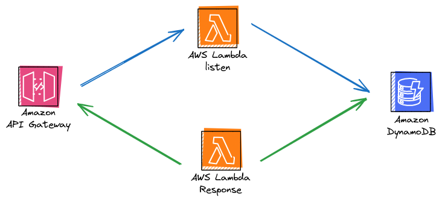
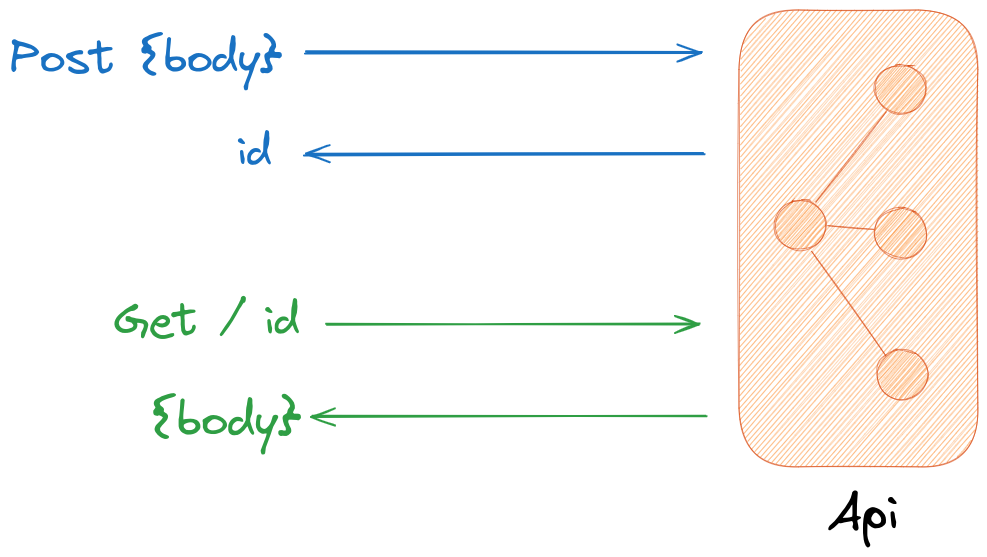

# Lambda base template for test pipelines
Lambda base template for test pipeline

# Mimic-Write-Read-DynamoDB

With the name mimic:

> mimic: imitate (someone or their actions or words), especially in order to entertain or ridicule.
 ref: https://languages.oup.com/google-dictionary-en/

How does it work:

We can post a body in the endpoint POST/listen, the stack return an ID and with this ID we can retrieve this body in GET/response.

Why is this useful?, Throughout of my years working with serverless, testing or mocking services (endpoint) and ephemeral environment were useful in the development process.

mimic-serverless-lab is a set of pipelines with the same stack (mimic) with Serverless Framework, Pulumi, Terraform, AWS Sam and CDK. The goal is compared the different pipelines with the same stack on AWS.

This link has the repository of code of mimic: https://github.com/olcortesb/mimic-src

# Motivations

The goal is created a laboratory for test different tools of IaC on the same code o the same stack.

Used this laboratory for POC and test, and write and shared content about serverless on AWS.

# Next Steps:

Take times of deploy of each deployment and compare

Test automatically destroy of resources for all pipelines

Build a strategy for test new version of the tools used in this lab

Shared the results of test and probes in a website

# References:

